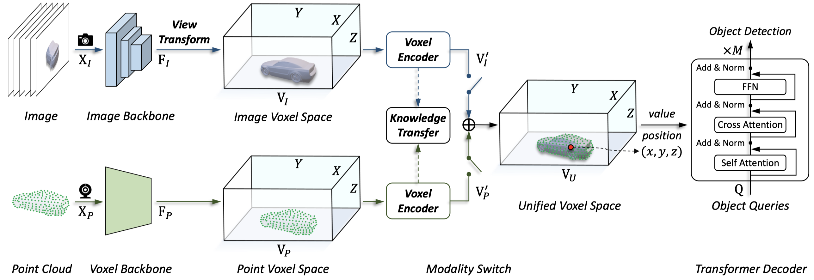

# UVTR
[](https://arxiv.org/abs/2206.00630)


**Unifying Voxel-based Representation with Transformer for 3D Object Detection**

Yanwei Li, Yilun Chen, Xiaojuan Qi, Zeming Li, Jian Sun, Jiaya Jia

[[`arXiv`](https://arxiv.org/abs/2206.00630)] [[`BibTeX`](#CitingUVTR)]

<div align="center">
  
</div><br/>

This project provides an implementation for the NeurIPS 2022 paper "[Unifying Voxel-based Representation with Transformer for 3D Object Detection](https://arxiv.org/abs/2206.00630)" based on [mmDetection3D](https://github.com/open-mmlab/mmdetection3d). UVTR aims to unify multi-modality representations in the voxel space for accurate and robust single- or cross-modality 3D detection.

## Preparation
This project is based on [mmDetection3D](https://github.com/open-mmlab/mmdetection3d), which can be constructed as follows.
* Install PyTorch [v1.7.1](https://pytorch.org/get-started/previous-versions/) and mmDetection3D [v0.17.3](https://github.com/open-mmlab/mmdetection3d/tree/v0.17.3) following [the instructions](https://github.com/open-mmlab/mmdetection3d/blob/v0.17.3/docs/getting_started.md).
* Copy our project and related files to installed mmDetection3D:
```bash
cp -r projects mmdetection3d/
cp -r extra_tools mmdetection3d/
```
* Prepare the nuScenes dataset following [the structure](https://github.com/open-mmlab/mmdetection3d/blob/v0.17.3/docs/data_preparation.md).
* Generate the unified data info and sampling database for nuScenes dataset:
```bash
python3 extra_tools/create_data.py nuscenes --root-path ./data/nuscenes --out-dir ./data/nuscenes --extra-tag nuscenes_unified
```

## Training
You can train the model following [the instructions](https://github.com/open-mmlab/mmdetection3d/blob/v0.17.3/docs/datasets/nuscenes_det.md).
You can find the pretrained models [here](https://drive.google.com/drive/folders/1KvG7tBYhmFQCiF_pAZc3Aa3H_D__-Jqh?usp=sharing) if you want to train the model from scratch.
For example, to launch UVTR training on multi GPUs,
one should execute:
```bash
cd /path/to/mmdetection3d
bash extra_tools/dist_train.sh ${CFG_FILE} ${NUM_GPUS}
```
or train with a single GPU:
```bash
python3 extra_tools/train.py ${CFG_FILE}
```

## Evaluation
You can evaluate the model following [the instructions](./docs/GETTING_STARTED.md).
For example, to launch UVTR evaluation with a pretrained checkpoint on multi GPUs,
one should execute:
```bash
bash extra_tools/dist_test.sh ${CFG_FILE} ${CKPT} ${NUM_GPUS} --eval=bbox
```
or evaluate with a single GPU:
```bash
python3 extra_tools/test.py ${CFG_FILE} ${CKPT} --eval=bbox
```
## nuScenes 3D Object Detection Results
We provide results on nuScenes *val* set with pretrained models.
|                                             | NDS(%) | mAP(%) | mATE&darr; | mASE&darr; | mAOE&darr; | mAVE&darr; | mAAE&darr; | download | 
|---------------------------------------------|:-------:|:-------:|:-------:|:---------:|:---------:|:---------:|:---------:|:---------:|
| **Camera-based** |
| [UVTR-C-R50-H5](projects/configs/uvtr/camera_based/camera/uvtr_c_r50_h5.py) | 40.1 | 31.3 | 0.810 | 0.281 | 0.486 | 0.793 | 0.187 | [GoogleDrive](https://drive.google.com/file/d/1gomNuo5--I5bdDiuiJxnhUbSw4GqE4VO/view?usp=sharing) |
| [UVTR-C-R50-H11](projects/configs/uvtr/camera_based/camera/uvtr_c_r50_h11.py) | 41.8 | 33.3 | 0.795 | 0.276 | 0.452 | 0.761 | 0.196 | [GoogleDrive](https://drive.google.com/file/d/1ZCwzpsByd5ZulgHltGQCIzoOZmI8FC12/view?usp=sharing) |
| [UVTR-C-R101](projects/configs/uvtr/camera_based/camera/uvtr_c_r101_h11.py) | 44.1 | 36.1 | 0.761 | 0.271 | 0.409 | 0.756 | 0.203 | [GoogleDrive](https://drive.google.com/file/d/1Mc3ZDGDPqc5uqZvrJswTn4TQdsEwtnAP/view?usp=sharing) |
| [UVTR-CS-R50](projects/configs/uvtr/camera_based/camera_sweep/uvtr_cs5_r50_h11.py) | 47.2 | 36.2 | 0.756 | 0.276 | 0.399 | 0.467 | 0.189 | [GoogleDrive](https://drive.google.com/file/d/1BHsUzTuColqtHEIXczhgC7SsWi_0mA69/view?usp=sharing) |
| [UVTR-CS-R101](projects/configs/uvtr/camera_based/camera_sweep/uvtr_cs4_r101_h11.py) | 48.3 | 37.9 | 0.739 | 0.267 | 0.350 | 0.510 | 0.200 | [GoogleDrive](https://drive.google.com/file/d/1JcNbnIBfp5us2CaEktr1-4t5jWOFLldA/view?usp=sharing) |
| [UVTR-L2C-R101](projects/configs/uvtr/camera_based/knowledge_distill/uvtr_l2c_r101_h11.py) | 45.0 | 37.2 | 0.735 | 0.269 | 0.397 | 0.761 | 0.193 | [GoogleDrive](https://drive.google.com/file/d/1Knc9EHeOjXtAkRzRAN0jPUFSiqK2t1Ac/view?usp=sharing) |
| [UVTR-L2CS3-R101](projects/configs/uvtr/camera_based/knowledge_distill/uvtr_l2cs3_r101_h11.py) | 48.8 | 39.2 | 0.720 | 0.268 | 0.354 | 0.534 | 0.206 | [GoogleDrive](https://drive.google.com/file/d/1Q5f-fESCKje9q98mj7v6pC9r_yYUw1-4/view?usp=sharing) |
| **LiDAR-based** |
| [UVTR-L-V0075](projects/configs/uvtr/lidar_based/uvtr_l_v0075_h5.py) | 67.6 | 60.8 | 0.335 | 0.257 | 0.303 | 0.206 | 0.183 | [GoogleDrive](https://drive.google.com/file/d/11wepYo4alFifpEEOtnmRJg6-plLE1QD8/view?usp=sharing) |
| **Multi-modality** |
| [UVTR-M-V0075-R101](projects/configs/uvtr/lidar_based/uvtr_l_v01_h5.py) | 70.2 | 65.4 | 0.333 | 0.258 | 0.270 | 0.216 | 0.176 | [GoogleDrive](https://drive.google.com/file/d/1dlxXIS4Cuv6ePxuxMRIaxpG_b1Pk8sqO/view?usp=sharing) |
## Acknowledgement
We would like to thank the authors of [mmDetection3D](https://github.com/open-mmlab/mmdetection3d) and [DETR3D](https://github.com/WangYueFt/detr3d) for their open-source release.

## License
`UVTR` is released under the [Apache 2.0 license](LICENSE).

## <a name="CitingUVTR"></a>Citing UVTR

Consider cite UVTR in your publications if it helps your research.

```
@inproceedings{li2022uvtr,
  title={Unifying Voxel-based Representation with Transformer for 3D Object Detection},
  author={Li, Yanwei and Chen, Yilun and Qi, Xiaojuan and Li, Zeming and Sun, Jian and Jia, Jiaya},
  booktitle={Advances in Neural Information Processing Systems},
  year={2022}
}
```
